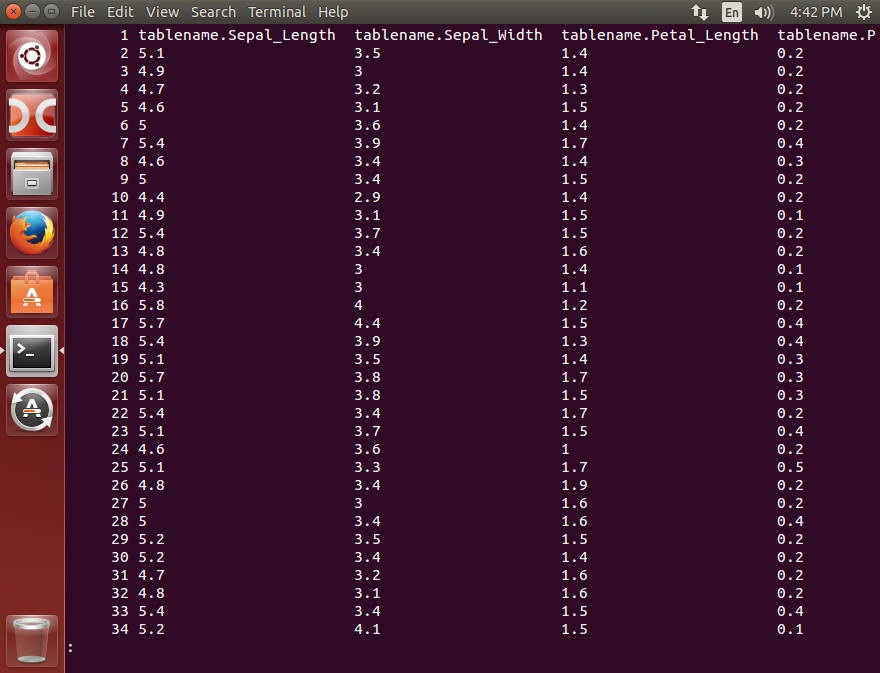
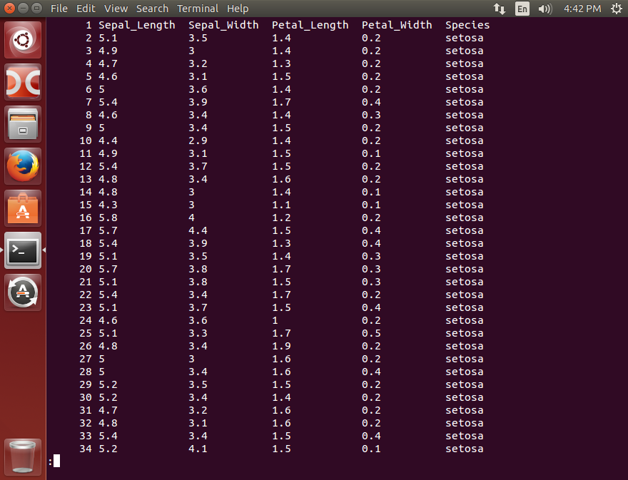
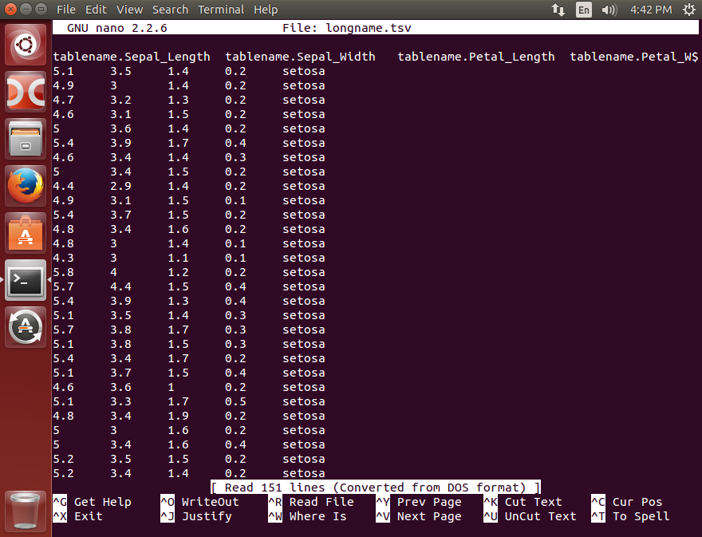

# TSV Viewer using Bash

## Motivation
To conveniently check what TSV (tab separated value) files in a unix/linux terminal environment. Because, in some corporate environment, it is really cumbersome to transfer tsv files out.

## What it does
- To show TSV files in a terminal with values and headers vertically aligned
- adapted from:
    http://unix.stackexchange.com/questions/29023/how-to-display-tsv-csv-in-console-when-empty-cells-are-missed-by-column-t
- Two versions are provided
    1. tv: TSV Viewer
    2. tvs: TSV Viwer Simplified. Removes from tablename from tablename.variable header


# How to use and what tv/tvs does

## tv

````
tv longname.tsv
````


- Shows TSV files so that variable names are vertically aligned with values

## tvs

````
tvs longname.tsv
````


- Useful when tablename is prepended to all variable names.

## Compared to using nano or any editor

````
nano longname.tsv
````



# Requirement

- Bash version 3+ supporting `=~`
- column
- cut
- sed
- less

# How to setup

- Copy the defined functions in .bashrc, .bash_profile, .profile
- Or, call this file from .bashrc, .bash_profile, .profile


